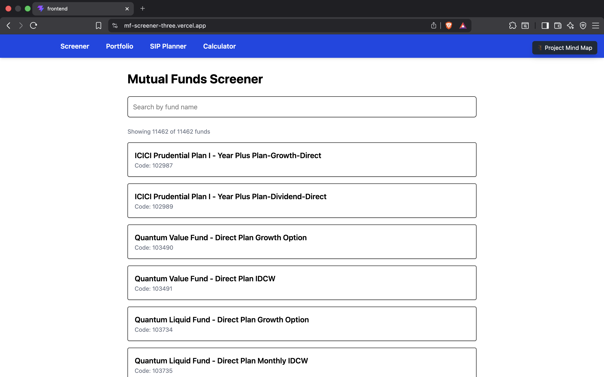
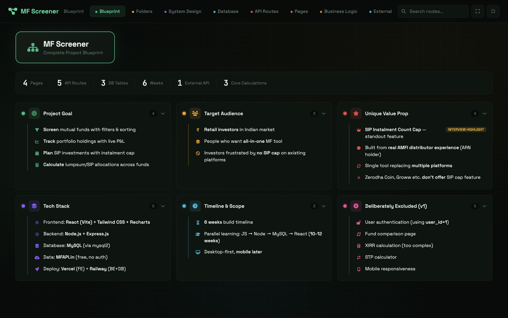
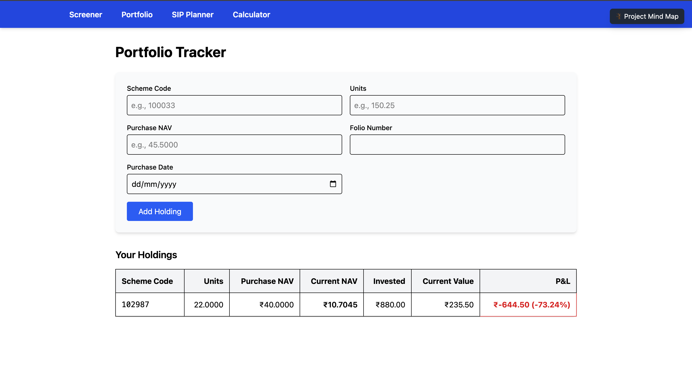
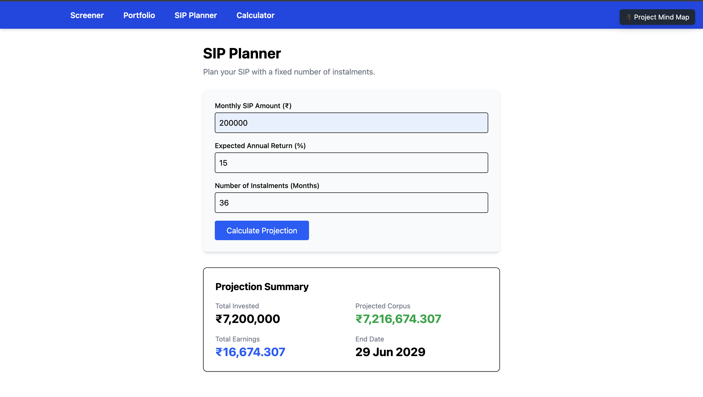
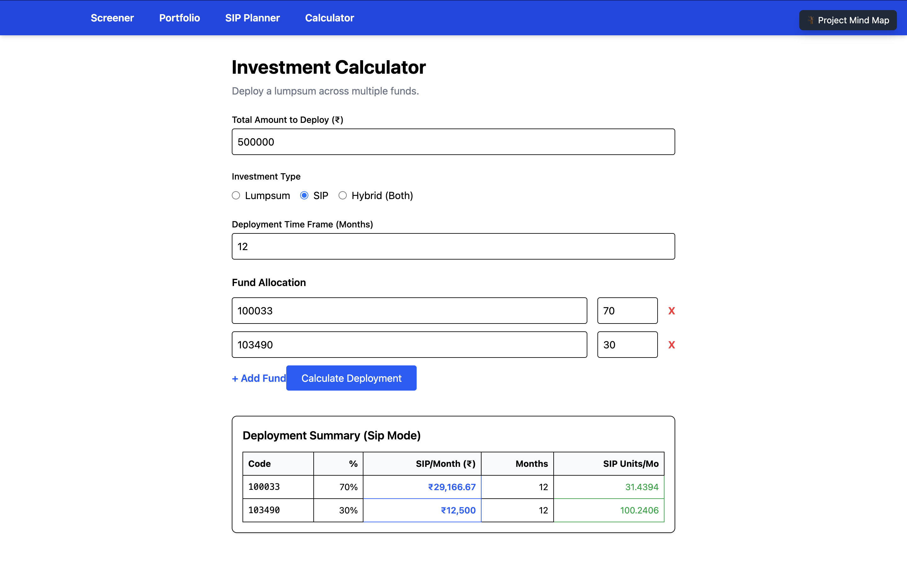

# 📊 Mutual Fund Screener & Portfolio Tracker

<p align="center">
  
</p>

<p align="center">
  
  
  
</p>

<p align="center">
  <a href="https://mf-screener-three.vercel.app/"><b>🔗 Live Demo</b></a> ·
  <a href="https://mf-screener-p8gd.onrender.com/api/health"><b>🔗 Backend API Health</b></a>
</p>

> A full-stack web app to screen mutual funds, plan SIPs, and track portfolios — built using **2+ years of real NISM-certified Mutual Fund Distributor experience** to solve gaps that exist in platforms like Zerodha Coin and Groww.

---

## 🧩 Why This Exists

As an MFD managing real client portfolios, I kept running into the same gap on every retail platform:

> **None of them let you plan a SIP by number of instalments.** You can set an amount and a duration, but not "deploy this exact amount over exactly 36 instalments." Every client who wanted a fixed-tenure SIP plan had to be calculated manually.

This project is built to fix that — along with a clean screener and portfolio tracker, using **free public AMFI data** (no paid APIs, no API keys needed).

---

## 🧠 Project Blueprint / Mind Map

<p align="center">
  
</p>

Before writing a single line of code, the entire project was scoped out in an interactive mind map covering goals, target audience, tech stack, timeline, and what to deliberately exclude from v1.

| | |
|---|---|
| **Pages** | 4 |
| **API Routes** | 5 |
| **DB Tables** | 3 |
| **Build Timeline** | 6 weeks |
| **External APIs** | 1 (MFAPI.in) |
| **Core Calculations** | 3 |

**Target audience:** Retail investors in the Indian market who want an all-in-one MF tool, especially those frustrated by the lack of an instalment-count-based SIP cap on existing platforms.

**Unique value proposition:** The SIP instalment-count cap — built directly from real AMFI distributor experience, and a feature that platforms like Zerodha Coin and Groww don't offer.

---

## ✨ What's Working in v1

### 🔍 Fund Screener
<p align="center">
  
</p>

- Live search across **11,461 real mutual funds**, pulled directly from AMFI via the **MFAPI.in** public API
- Each fund shows its name and AMFI scheme code
- Real-time search-as-you-type filtering

### 📁 Portfolio Tracker
<p align="center">
  
</p>

- Add holdings by scheme code, units, purchase NAV, folio number, and purchase date
- Holdings list view (current value & returns calculation in progress for v2)

### 🗓️ SIP Planner *(Core Differentiator)*
<p align="center">
  
</p>

- Input: monthly SIP amount, expected annual return %, and a **fixed number of instalments**
- Solves the exact gap described above — instalment-count-based SIP planning, missing from major platforms

### 🧮 Investment Calculator
<p align="center">
  
</p>

- Deploy a lump sum across multiple funds by allocation %
- Supports **Lumpsum**, **SIP**, or **Hybrid** deployment modes
- Add unlimited funds with scheme code + allocation percentage

---

## 🛠️ Tech Stack

| Layer | Technology |
|---|---|
| Frontend | React (Vite) + Tailwind CSS + Recharts |
| Backend | Node.js + Express.js |
| Database | MySQL (via `mysql2`) |
| Data Source | [MFAPI.in](https://www.mfapi.in/) — free, public, no auth required |
| Deployment | Frontend on **Vercel** · Backend on **Render** |

---

## 🚀 Live Deployment

| Service | Link |
|---|---|
| Frontend | [mf-screener-three.vercel.app](https://mf-screener-three.vercel.app/) |
| Backend Health Check | [mf-screener-p8gd.onrender.com/api/health](https://mf-screener-p8gd.onrender.com/api/health) |

> Note: Backend is hosted on Render's free tier, so it may take 30–50 seconds to respond on the first request after a period of inactivity.

---

## 🗂️ Project Structure

```
mf-screener/
├── frontend/                 # React (Vite) app
│   ├── src/
│   │   ├── pages/            # Screener, Portfolio, SIP Planner, Calculator
│   │   └── components/
├── backend/                  # Node.js + Express API
│   ├── routes/
│   ├── controllers/
│   └── config/                # MySQL connection
├── docs/                      # Screenshots used in this README
└── README.md
```

---

## ⚙️ Getting Started

### 1. Clone the repo
```bash
git clone https://github.com/ranayashwant/mf-screener.git
cd mf-screener
```

### 2. Set up the backend
```bash
cd backend
npm install
# create a .env file with your MySQL credentials
npm start
```

### 3. Set up the frontend
```bash
cd ../frontend
npm install
npm run dev
```

App runs at `http://localhost:5174`

---

## 🗺️ Roadmap

**✅ v1 — Done**
- [x] Project planning & full mind-map blueprint
- [x] Fund Screener with live AMFI data (11,461 funds)
- [x] Portfolio Tracker (add holdings)
- [x] SIP Planner with instalment-count logic
- [x] Investment Calculator (Lumpsum / SIP / Hybrid)
- [x] Backend connected to MySQL
- [x] Frontend deployed on Vercel, Backend deployed on Render

**🔜 v2 — Planned**
- [ ] **Database seeding** — pre-load fund data instead of hitting live API on every request
- [ ] **24-hour fund data refresh cycle** — cache AMFI data and refresh once daily for faster load times and fewer external API calls
- [ ] Live NAV-based current value & returns on Portfolio page
- [ ] Filters & sorting on Screener (category, risk, returns, expense ratio)
- [ ] Fund detail page with NAV history chart (Recharts)
- [ ] User authentication (currently hardcoded `user_id`)

**❌ Deliberately Excluded from v1** *(to ship faster)*
- Fund comparison page
- XIRR calculation
- STP calculator
- Mobile responsiveness

---

## 👤 Author

**Rana Yashwant Singh**
- 🎓 B.Tech ECE, DSMNRU · GATE CSE 2026 (~89th percentile)
- 💼 Ex-NISM Certified Mutual Fund Distributor (2+ years, ₹40L AUM managed)
- 🔗 [LinkedIn](https://linkedin.com/in/ranayashwant) · [GitHub](https://github.com/ranayashwant)
- 📧 yashwant2609@gmail.com

---

## 📄 License

This project is licensed under the MIT License.

---

> *"Built by someone who actually used the tools this replaces."*